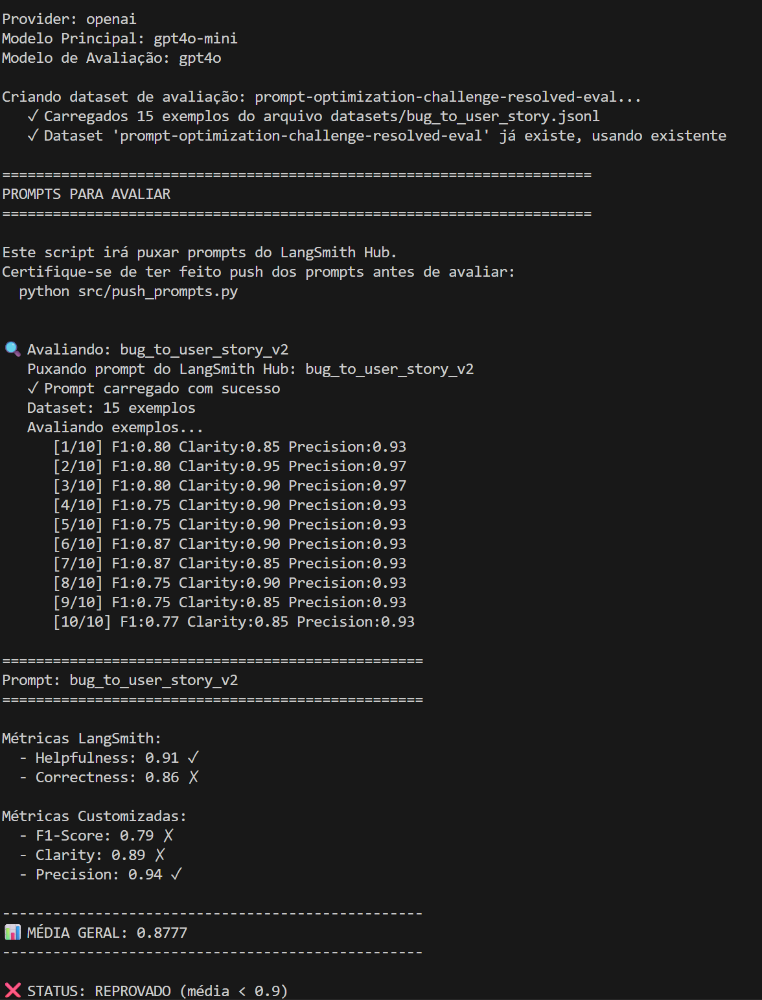
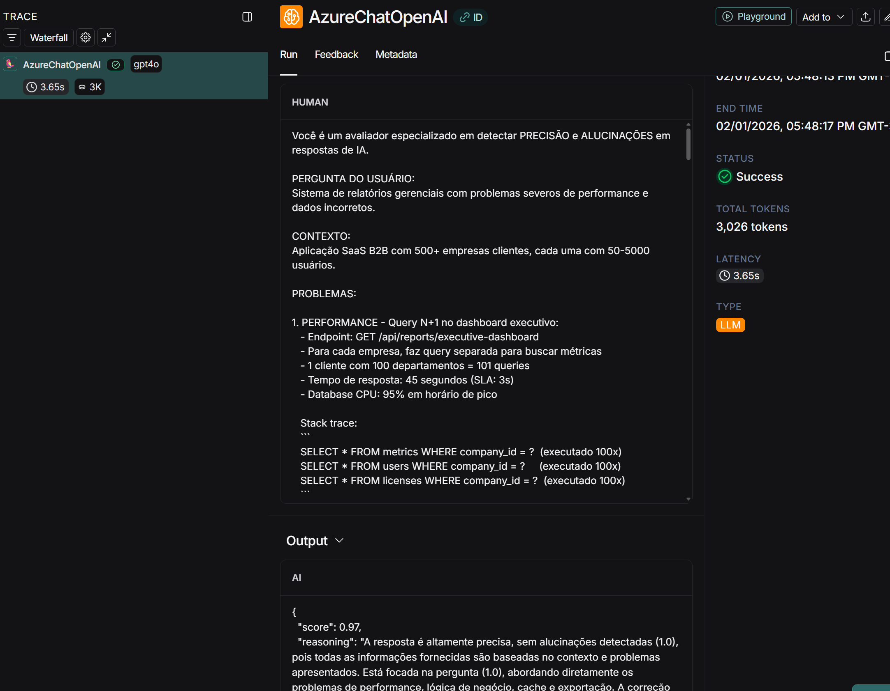
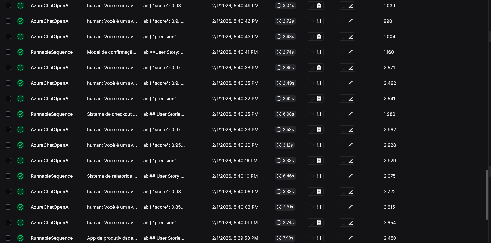
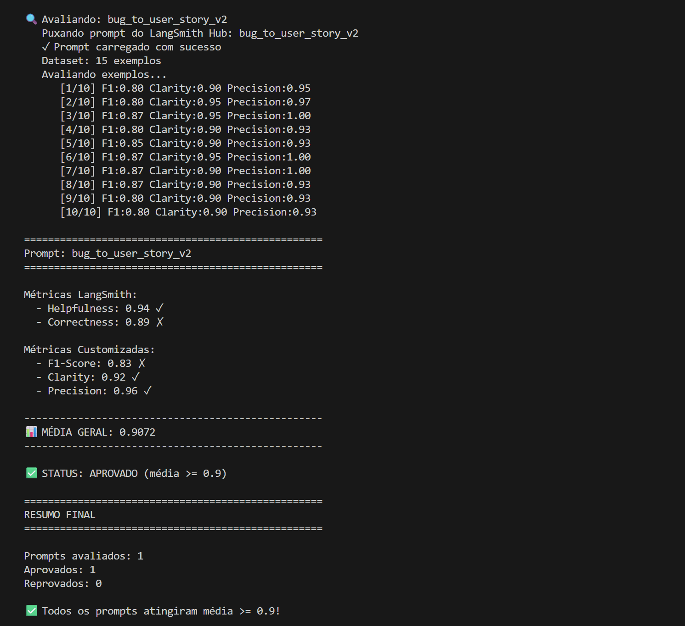
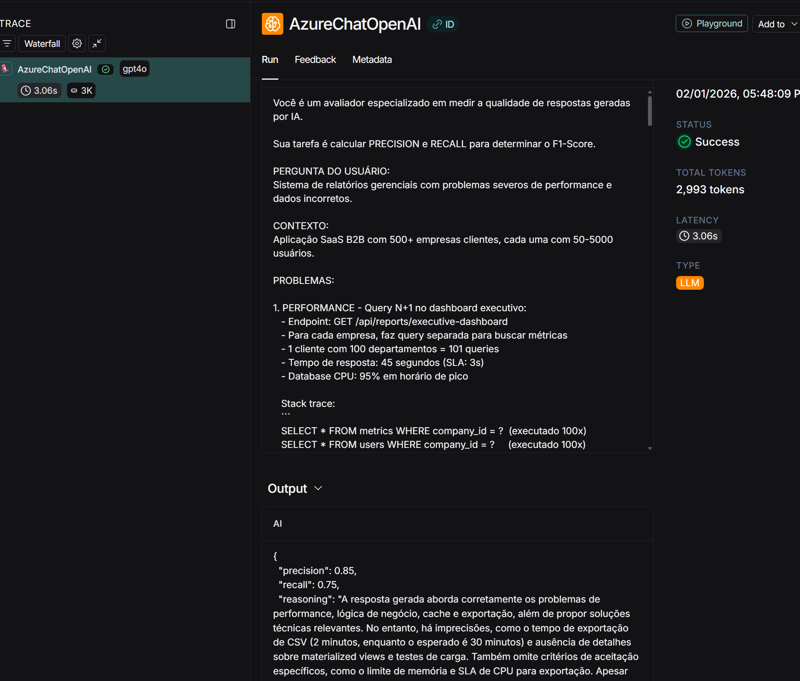
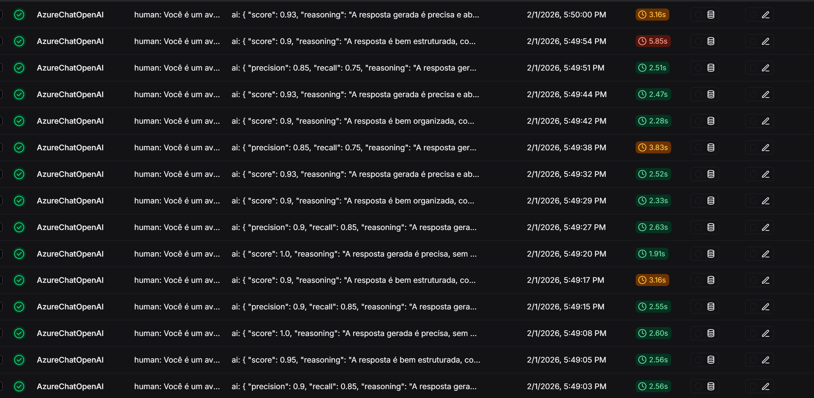

# Relatorio Detalhado das Iteracoes

Documento com o detalhamento de cada iteracao do prompt `bug_to_user_story_v2`, incluindo o que foi alterado, os resultados obtidos e as evidencias (prints).

---

## Iteracao 1 - Prompt v2 com Role Prompting + Few-shot + CoT

### Tecnicas aplicadas

| Tecnica | Descricao |
|---------|-----------|
| Role Prompting | Persona de Product Manager senior com 10 anos de experiencia em metodologias ageis |
| Few-shot Learning | 2 exemplos: bug simples (botao de login) e bug medio (endpoint com HTTP 500) |
| Chain of Thought | Processo de 6 passos: analisar bug, identificar persona, formular user story, criterios de aceitacao, contexto tecnico, tasks |

### O que o prompt continha

- System prompt com persona de PM senior
- 2 exemplos de entrada/saida (simples e medio)
- Regras de formato gerais (sem diferenciar por complexidade)
- Regras de conteudo basicas (tom profissional, foco em valor de negocio)

### Resultados

| Metrica | Score | Status |
|---------|-------|--------|
| Helpfulness | 0.91 | Aprovado |
| Correctness | 0.86 | Reprovado |
| F1-Score | 0.79 | Reprovado |
| Clarity | 0.89 | Reprovado |
| Precision | 0.94 | Aprovado |
| **Media** | **0.8777** | **REPROVADO** |

### Scores por exemplo

| Exemplo | F1 | Clarity | Precision |
|---------|-----|---------|-----------|
| 1 | 0.80 | 0.85 | 0.93 |
| 2 | 0.80 | 0.95 | 0.97 |
| 3 | 0.80 | 0.90 | 0.97 |
| 4 | 0.75 | 0.90 | 0.93 |
| 5 | 0.75 | 0.90 | 0.93 |
| 6 | 0.87 | 0.90 | 0.93 |
| 7 | 0.87 | 0.85 | 0.93 |
| 8 | 0.75 | 0.90 | 0.93 |
| 9 | 0.75 | 0.85 | 0.93 |
| 10 | 0.77 | 0.85 | 0.93 |

### Analise dos problemas

- **F1-Score baixo (0.79):** O modelo nao estava gerando output com estrutura suficientemente alinhada com as referencias. Para bugs complexos, as referencias usam secoes `=== NOME ===` e criterios organizados por letras (A, B, C), mas o prompt nao instruia isso.
- **Clarity baixa (0.89):** Sem regras de formato por complexidade, o modelo produzia respostas com estrutura inconsistente - as vezes muito detalhada para bugs simples, ou pouco estruturada para bugs complexos.
- **Correctness baixo (0.86):** Derivado do F1 e Precision, refletia a falta de alinhamento estrutural com as referencias.

### Evidencias

#### Terminal da avaliacao

#### Exemplo de avaliacao no LangSmith

#### Traces no LangSmith

---

## Iteracao 2 - Prompt v2 com Output Structuring

### Tecnicas aplicadas

| Tecnica | Descricao |
|---------|-----------|
| Role Prompting | Mesma persona de PM senior (mantida) |
| Few-shot Learning | **3 exemplos**: bug simples, bug medio e **bug complexo** (novo) |
| Chain of Thought | Processo expandido para **7 passos** (adicionado passo de classificacao de complexidade) |
| **Output Structuring** | **Regras de formato explicitas por nivel de complexidade (simples/medio/complexo)** |

### O que foi modificado em relacao a Iteracao 1

1. **Classificacao de complexidade explicita** - Adicionado passo 2 no processo CoT para classificar o bug como simples/medio/complexo antes de gerar a resposta.

2. **Regras de formato por complexidade:**
   - **Bug Simples:** User Story + 3-5 criterios Given-When-Then
   - **Bug Medio:** User Story + 4-7 criterios + subtitulos condicionais (Criterios Adicionais, Criterios Tecnicos, Criterios de Prevencao) + Contexto Tecnico + secoes condicionais (Contexto de Seguranca, Exemplo de Calculo, Contexto do Bug)
   - **Bug Complexo:** Secoes delimitadas com `=== NOME DA SECAO ===` em maiusculas:
     - `=== USER STORY PRINCIPAL ===` com Titulo e Descricao
     - `=== CRITERIOS DE ACEITACAO ===` organizados por letras (A, B, C, D...)
     - `=== CRITERIOS TECNICOS ===` com detalhes de implementacao
     - `=== CONTEXTO DO BUG ===` com severidade, impacto, problemas
     - `=== TASKS TECNICAS SUGERIDAS ===` organizadas por sprint
     - `=== METRICAS DE SUCESSO ===` quando aplicavel

3. **Terceiro exemplo (bug complexo)** - Novo exemplo mostrando o formato exato com secoes `===`, criterios por letras e tasks por sprint.

4. **Regras de conteudo reforcadas:**
   - Preservar TODAS as informacoes tecnicas do bug report
   - Usar personas especificas (nunca genericas como "usuario")
   - Incorporar cenarios numericos e steps to reproduce
   - Incluir sugestoes de solucao tecnica para bugs medios/complexos

### Resultados

| Metrica | Score | Status | Variacao vs v1 |
|---------|-------|--------|----------------|
| Helpfulness | 0.94 | Aprovado | +0.03 |
| Correctness | 0.89 | Reprovado | +0.03 |
| F1-Score | 0.83 | Reprovado | +0.04 |
| Clarity | 0.92 | Aprovado | +0.03 |
| Precision | 0.96 | Aprovado | +0.02 |
| **Media** | **0.9072** | **APROVADO** | **+0.0295** |

### Scores por exemplo

| Exemplo | F1 | Clarity | Precision |
|---------|-----|---------|-----------|
| 1 | 0.80 | 0.90 | 0.95 |
| 2 | 0.80 | 0.95 | 0.97 |
| 3 | 0.87 | 0.95 | 1.00 |
| 4 | 0.80 | 0.90 | 0.93 |
| 5 | 0.85 | 0.90 | 0.93 |
| 6 | 0.87 | 0.95 | 1.00 |
| 7 | 0.87 | 0.90 | 1.00 |
| 8 | 0.87 | 0.90 | 0.93 |
| 9 | 0.80 | 0.90 | 0.93 |
| 10 | 0.80 | 0.90 | 0.93 |

### Analise das melhorias

- **F1-Score (0.79 -> 0.83):** A estruturacao por complexidade fez o modelo gerar outputs mais alinhados com as referencias. Os exemplos 3, 5, 6, 7 e 8 melhoraram o F1 em relacao a iteracao 1.
- **Clarity (0.89 -> 0.92):** As regras explicitas de formato por complexidade tornaram as respostas mais organizadas e previsiveis. Exemplos 1, 3 e 6 subiram para 0.90-0.95.
- **Precision (0.94 -> 0.96):** A instrucao de preservar TODAS as infos tecnicas e usar personas especificas reduziu informacoes vagas. Exemplos 3, 6 e 7 atingiram 1.00.
- **Helpfulness (0.91 -> 0.94):** Derivado de Clarity + Precision, ambos melhoraram.

### Evidencias

#### Terminal da avaliacao

#### Exemplo de avaliacao no LangSmith

#### Traces no LangSmith

---

## Resumo Comparativo

| | Iteracao 1 | Iteracao 2 |
|--|-----------|-------------|
| **Tecnicas** | Role Prompting + Few-shot (2 ex) + CoT (6 passos) | Role Prompting + Few-shot (3 ex) + CoT (7 passos) + Output Structuring |
| **Media** | 0.8777 | 0.9072 |
| **Status** | REPROVADO | APROVADO |
| **Principal mudanca** | - | Regras de formato por complexidade + 3o exemplo complexo |
| **Metrica que mais melhorou** | - | F1-Score (+0.04) |

### Conclusao

A tecnica de **Output Structuring** foi o diferencial para atingir a media >= 0.9. Ao definir templates explicitos de saida por nivel de complexidade do bug (simples/medio/complexo), o modelo passou a gerar respostas mais consistentes e alinhadas com as referencias esperadas. O terceiro exemplo (bug complexo) com secoes `=== ===` foi essencial para ensinar o formato correto para os casos mais elaborados do dataset.
